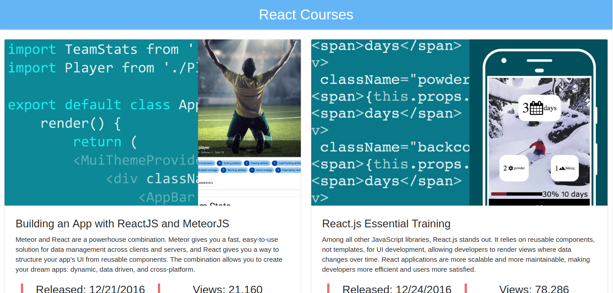

# Lynda React Courses

Simple Courses project with a list of courses from [lynda.com](lynda.com) built 
used React and Materialize. A basic application ready to turn into a React Native application.

### How to use

Download and install the Node.Js and NPM using the [NVM](https://github.com/creationix/nvm).

Install the [yarn](https://yarnpkg.com/en/) following the official 
[documentation](https://yarnpkg.com/lang/en/docs/install/#linux-tab).

Clone the repository and install the node modules.

`yarn install`

After this, you can run the application.

***

#### Running the application

You can use the Yarn to serve this application.

To do this on the root of the project use the `yarn start` command.

Then navigate your browser to http://localhost:3000 to see the app running.
